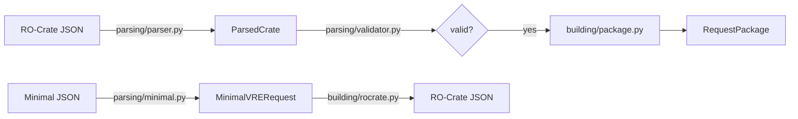

# vre-rocrate Library Structure Refactor Plan

## Current Problems

All modules are flat in `src/vre_rocrate/`:

```
vre_rocrate/
├── __init__.py
├── builder.py          # RequestPackageBuilder + RocrateBuilder (mixed concerns)
├── constants.py
├── exceptions.py
├── minimal.py          # MinimalVRERequest models + form parser
├── models.py           # 470 lines: Entity, ParsedCrate, RequestPackage,
│                       # WorkflowDescriptor, FileReference, FormalParameter,
│                       # RuntimePlatform, IMInputFile (unrelated things)
├── parser.py
└── validator.py
```

Issues:
1. **`models.py` is a grab-bag** — core RO-Crate entities, request-package dataclasses, and infrastructure-manager types all live in one file.
2. **`builder.py` mixes two builders** — `RequestPackageBuilder` (RO-Crate → RequestPackage) and `RocrateBuilder` (minimal → RO-Crate JSON) are completely different concerns.
3. **No visual hierarchy** — a new reader can't tell at a glance what the library does.

## Proposed Structure

```
vre_rocrate/
├── __init__.py              # Public API — re-exports everything
├── constants.py             # VRE_TYPES, VRE_TYPE_TO_PROGRAMMING_LANGUAGE
├── exceptions.py            # VreRocrateError, CrateValidationError
├── models/                  # All data models (dataclasses & Pydantic)
│   ├── __init__.py
│   ├── rocrate.py           # Entity, ParsedCrate, _MetadataProxy
│   ├── package.py           # RequestPackage, WorkflowDescriptor,
│   │                        # FileReference, FormalParameter
│   ├── minimal.py           # MinimalVRERequest, MinimalFileInput
│   └── infrastructure.py    # RuntimePlatform, IMInputFile
├── parsing/                 # All parsing & validation logic
│   ├── __init__.py
│   ├── parser.py            # ROCrateParser
│   ├── validator.py         # ValidationPipeline
│   └── minimal.py           # parse_minimal_vre_form
└── building/                # All builders
    ├── __init__.py
    ├── package.py           # RequestPackageBuilder
    └── rocrate.py           # RocrateBuilder
```

## Rationale

| Package | Responsibility | What's inside |
|---------|---------------|---------------|
| `models/` | **Data definitions** — pure dataclasses & Pydantic models with no logic | `Entity`, `ParsedCrate`, `RequestPackage`, `MinimalVRERequest`, `RuntimePlatform` |
| `parsing/` | **Input processing** — turning external formats (RO-Crate JSON, multipart form) into models | `ROCrateParser`, `ValidationPipeline`, `parse_minimal_vre_form` |
| `building/` | **Output generation** — turning models into external formats (RO-Crate JSON, RequestPackage) | `RequestPackageBuilder`, `RocrateBuilder` |

This mirrors a classic **parse → model → build** pipeline:



## Public API (backward-compatible)

Top-level `__init__.py` re-exports everything so existing imports still work:

```python
from vre_rocrate import RequestPackage, ROCrateParser, ValidationPipeline
```

Users can also import from subpackages for clarity:

```python
from vre_rocrate.models import RequestPackage, ParsedCrate
from vre_rocrate.parsing import ROCrateParser, ValidationPipeline
from vre_rocrate.building import RequestPackageBuilder, RocrateBuilder
```

## Execution Steps

1. Create `models/`, `parsing/`, `building/` directories with `__init__.py` files.
2. **Split `models.py`** into:
   - `models/rocrate.py` — `Entity`, `ParsedCrate`, `_MetadataProxy`
   - `models/package.py` — `RequestPackage`, `WorkflowDescriptor`, `FileReference`, `FormalParameter`
   - `models/minimal.py` — `MinimalVRERequest`, `MinimalFileInput`
   - `models/infrastructure.py` — `RuntimePlatform`, `IMInputFile`
3. **Split `builder.py`** into:
   - `building/package.py` — `RequestPackageBuilder`
   - `building/rocrate.py` — `RocrateBuilder`
4. **Move parsing logic**:
   - `parser.py` → `parsing/parser.py`
   - `validator.py` → `parsing/validator.py`
   - `minimal.py` (form parser) → `parsing/minimal.py`
5. Update all internal imports.
6. Update top-level `__init__.py` to re-export from subpackages.
7. Run tests and black formatting.
